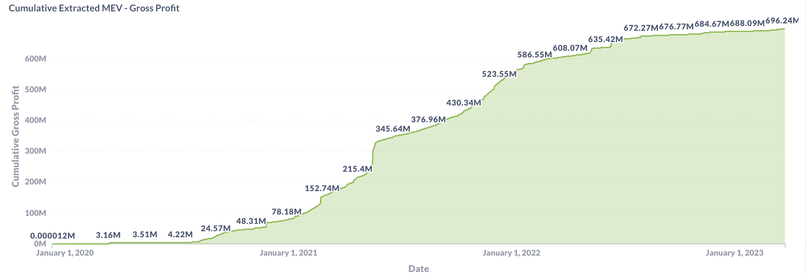
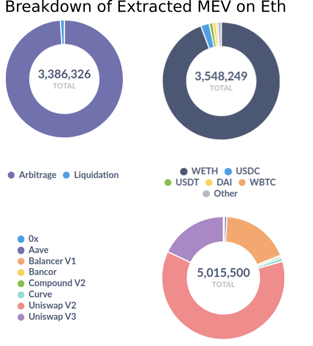
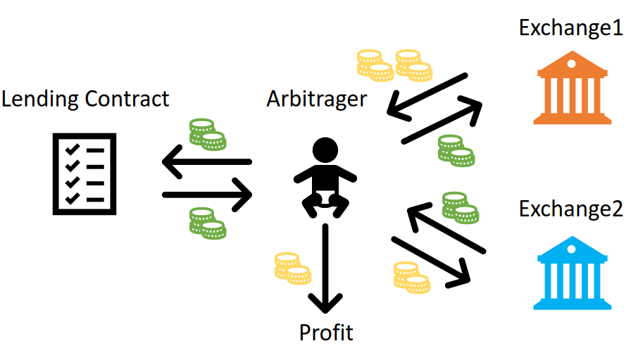
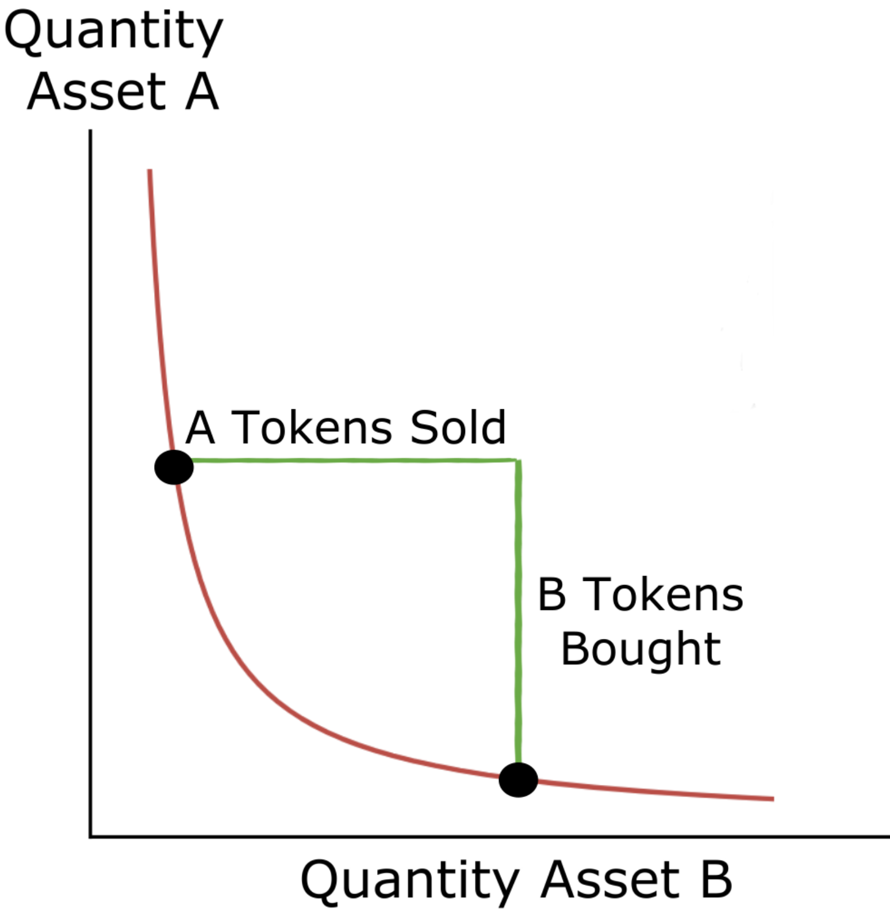
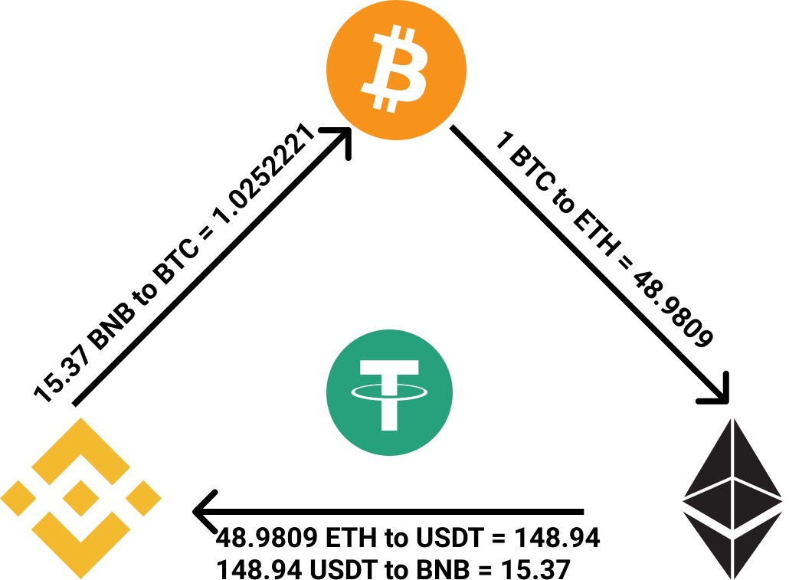

# Side Project: Arbitrage at Crypto Market with Optimal Profit

Date: 2023.05.01 | Author: Zihan Ding

This project delves into capturing arbitrage opportunities in crypto trading across different markets. I found the process both fascinating and instructive, and wanted to share the journey here. It’s a hands-on exploration of financial strategy and game-theoretic equilibrium in the crypto ecosystem.

## Introduction

Crypto markets are strange because they are both financial markets and executable software. A token is not only something people buy and sell; it is also an object that can be moved by a smart contract, routed through decentralized exchanges, borrowed, swapped, and repaid inside a single transaction. This makes the market feel less like a traditional exchange floor and more like a programmable game with money, latency, liquidity, and adversarial bots all interacting at once.

In centralized finance, arbitrage often requires capital, accounts, market access, and settlement infrastructure. In decentralized finance, some of that machinery is compressed into smart contracts. Decentralized exchanges such as Uniswap and Sushiswap do not rely on a central order book. Instead, they use liquidity pools governed by automatic market makers (AMMs). The price of a token is determined by the pool reserves, and every trade changes those reserves. Because each exchange has different liquidity and order flow, the same token pair can temporarily have different prices on different exchanges.

That gap is where arbitrage lives. If WBTC is cheaper on one exchange and more expensive on another, a trader can buy where it is cheap and sell where it is expensive. In practice, the opportunity is fragile. The act of trading moves the prices. Gas fees can eat the spread. Other bots may compete for the same opportunity. A profitable-looking trade can become unprofitable once slippage, swap fees, flash-loan fees, and execution costs are counted.

Flash loans add one more interesting ingredient. They let a trader borrow a large amount of tokens without collateral, as long as the borrowed assets are returned inside the same atomic blockchain transaction. If any step fails, the whole transaction is reverted. This makes flash loans especially useful for arbitrage: a bot can borrow capital, trade across decentralized exchanges, repay the loan, and keep the remaining profit, all in one transaction.

<figure>
<figcaption>Cumulative extracted MEV gross profit. Arbitrage is not a toy problem in DeFi; it is part of a large market of automated on-chain value extraction.</figcaption></figure>

<figure>
<figcaption>Extracted MEV composition by strategy, token, and protocol. Arbitrage dominates many observed MEV opportunities.</figcaption></figure>

This post describes an automated flash-loan arbitrage bot for crypto markets. The bot monitors token prices across decentralized exchanges, detects price discrepancies, predicts slippage under AMM rules, computes the optimal trade amount, and executes a flash-loan contract only when the predicted profit exceeds the fees.

The key idea is simple: arbitrage should not blindly trade the largest possible amount. A large trade changes the pool reserves, creates slippage, and can erase the opportunity it is trying to exploit. Instead, the trading amount should be chosen so that the post-trade exchange rates move toward equilibrium while still leaving positive profit after flash-loan fees, swap fees, and gas.

There are four main pieces of the method:

- Build a bot for flash-loan arbitrage across exchanges.
- Monitor real-time prices of multiple tokens, including examples such as WBTC, LUSD, LETH, and WETH.
- Predict the price during transactions using AMM reserve dynamics.
- Derive the trading amount while accounting for flash-loan fees, transaction fees on each exchange, gas fees, and slippage.

## What the Bot Does

The system has two main pieces:

- A Solidity smart contract that executes flash-loan swaps atomically across exchanges.
- A Python bot that monitors reserves, predicts prices, estimates fees, solves for an approximately optimal trade amount, and triggers the contract.

<figure>
<figcaption>A two-hop flash-loan arbitrage. The arbitrageur borrows from a lending contract, swaps across two exchanges, repays the loan, and keeps the remaining profit.</figcaption></figure>

The bot supports arbitrary swap orders on Uniswap V2 and Sushiswap with arbitrary tokens. The price monitor also considers major DeFi exchanges such as Uniswap V2, Uniswap V3, and Sushiswap. In the experiments, I used tokens such as WBTC, LUSD, LETH, WETH, and common pairs involving assets like ETH and USDT. The implementation chooses the borrowed token, trading amount, and trading sequence automatically.

The intended workflow is:

1. Monitor exchange reserves and gas costs in real time.
2. Detect a candidate price discrepancy across exchanges.
3. Predict how the candidate trade will change the AMM reserves and effective prices.
4. Solve for an approximately optimal trade amount.
5. Trigger the flash-loan contract only when predicted profit after fees is positive.

The system can be evaluated in two ways: back-testing against historical reserve and price data, and live trading experiments where the contract executes an actual flash-loan transaction. The WBTC/LUSD example below is a live-style execution record, including the monitored values, predicted outcome, actual post-trade values, gas fee, and realized profit.

## Why Monitoring Reserves Matters

Token prices can differ across decentralized exchanges because each pool has its own liquidity, demand, available token supply, fee structure, and arbitrage competition. An arbitrage bot therefore begins by continuously monitoring exchange reserves rather than only reading a displayed spot price.

For a pool with reserve $r_t^a$ of asset $a$ and reserve $r_t^b$ of asset $b$, the instantaneous AMM price can be approximated as:

$$
p_t = \frac{r_t^b}{r_t^a}.
$$

When the same token pair has sufficiently different prices across two exchanges, the bot treats this as a candidate opportunity. It does not execute immediately. It first estimates whether the spread survives after slippage and transaction costs. This is the core job of the monitoring system: stay up to date with token prices across multiple exchanges, identify profitable arbitrage opportunities, and pass only plausible opportunities to the execution layer.

## Flash Loans Make the Trade Atomic

A flash loan allows the bot to borrow capital, execute a sequence of swaps, and repay the borrowed amount in one transaction. This atomicity is important for two reasons.

First, it removes the need for upfront collateral. The blockchain guarantees that if the loan cannot be repaid, the transaction is reverted.

Second, it reduces execution risk. The arbitrage path is not split across multiple independent transactions, so the bot avoids being left with an incomplete position if one swap succeeds and another fails.

Flash loans also enable instant multiple swaps among exchanges within the same transaction, with the validity of the whole operation guaranteed by smart contracts. This helps reduce exposure to front-running bots: if the entire arbitrage happens atomically, there is less room for a separate bot to observe one leg of the strategy and step in before the remaining legs execute.

The cost model includes:

- Flash-loan fee, approximately $t_l = 0.09\%$ in our setting.
- Exchange swap fee, approximately $t_f = 0.3\%$ per swap.
- Gas fee for executing the transaction.
- Slippage caused by changing AMM pool reserves during the trade.

The exact fee values can vary by platform and market condition, but these constants give a concrete working model for the experiments.

## Predicting Slippage

Most constant-product AMMs maintain a relationship between pool reserves. When a trader sells amount $\delta^a$ of asset $a$ into a pool, the reserves and effective price shift. We approximate the post-trade price as:

<figure>
<figcaption>Constant-product market maker intuition. Selling asset A into the pool moves the reserve point along the curve and changes the effective price for asset B.</figcaption></figure>

The constant-product market maker is a common AMM design used in decentralized exchanges. Instead of matching buyers and sellers through an order book, the exchange creates a liquidity pool with two tokens, such as ETH and DAI, and keeps the product of their quantities approximately constant. A trader submits an order to the pool, and the pool quotes a price from the current reserve ratio. After the trade, both reserves change, and therefore the price changes as well.

This is why slippage matters. Slippage is the gap between the initial midpoint price and the average execution price. In this setting, the bot is not merely asking, "what is the current price?" It is asking, "if I trade this much, what average price will I actually receive after I move the pool?"

$$
p_{t+\delta_t}(r_t^a, r_t^b, \delta^a) =
\frac{r_t^b - (1-t_f)\delta^a r_t^b / r_t^a}{r_t^a+\delta^a}.
$$

The average execution price during the transaction is approximated by:

$$
\overline{p} \approx \frac{p_t + p_{t+\delta_t}}{2}.
$$

Then the amount of asset $b$ received from selling $\delta^a$ can be estimated as:

$$
\delta^b \approx (1-t_f)\overline{p}\delta^a.
$$

This approximation lets the bot predict how much the arbitrage itself will move the market before sending the transaction. That prediction is the difference between opportunistic trading and simply donating gas to the network.

## Choosing the Trade Size

The central optimization problem is to choose a trade amount that maximizes profit while moving the two exchange prices toward equilibrium. The strategy is to buy the token where it is cheap, sell where it is expensive, and choose the amount so that the opportunity is mostly eliminated by the atomic transaction itself.

There are two ingredients:

- Multi-token price prediction across exchanges: study each exchange's AMM pricing rule and predict the effect of a candidate transaction.
- Optimal amount selection: choose the amount that moves the relevant exchange rates toward equilibrium while keeping profit positive after fees.

Suppose the bot sells amount $x$ of asset $a$ on the first exchange, receives asset $b$, and then trades back on the second exchange. The equilibrium condition can be written as:

\begin{aligned}
\frac{r_t^{b,1} - \overline{p}^{\,b,1}(1-t_f)x}{r_t^{a,1} + x}
&=
\frac{r_t^{b,2}+\overline{p}^{\,b,1}(1-t_f)x}
{r_t^{a,2}-\overline{p}^{\,a,2}(1-t_f)\widehat{x}}.
\end{aligned}

where $r_t^{i,j}$ is the reserve of asset $i$ on exchange $j$ at time $t$, $\overline{p}^{\,i,j}$ is the predicted average price of asset $i$ on exchange $j$, and the predicted amount of asset $a$ received from the second exchange is:

$$
\widehat{x}=\overline{p}^{\,b,1}(1-t_f)x.
$$

Expanding this condition can produce a sixth-order polynomial in $x$, which generally does not have a convenient closed-form solution. The implementation therefore uses grid search with step size $0.01$ over the range $0.01$ to $10$ to approximate the optimal amount to trade on the first exchange. The predicted optimal profit is:

$$
v^* = \overline{p}^{\,a,2}(1-t_f)\widehat{x} - x.
$$

This profit is measured in the unit of the first asset. The contract is triggered only when the predicted profit minus the monitored instant gas fee is positive.

## An Example: WBTC and LUSD

In one run, the bot detected that WBTC had a higher price on Uniswap and a lower price on Sushiswap. A fixed-borrow baseline would always borrow a constant amount, such as $0.01$ WBTC, sell it on Sushiswap for LUSD, and buy it back on Uniswap. That is simple, but it is not optimal: the best amount depends on reserves, fees, and slippage at the moment of execution.

Instead, the bot identified the arbitrage opportunity on its own, chose which token to borrow, computed how much to borrow, and determined the trading sequence. For this transaction, it computed an optimal trade size of $1.04$ WBTC using the monitored LUSD and WBTC reserves on both Uniswap and Sushiswap, together with predicted slippage for the two-hop transaction.

Before the flash-loan transaction, the observed exchange rates were:

- Uniswap exchange rate: $82470.3012$
- Sushiswap exchange rate: $9156.0969$

After simulating the optimal trade, the predicted post-trade rates were:

- Uniswap exchange rate: $23942.5982$
- Sushiswap exchange rate: $23897.4991$
- Predicted gas fee: $0.0015$ Goerli ETH
- Predicted profit: $1.9149$ WBTC

After execution, the actual values were:

- Uniswap exchange rate: $23895.4631$
- Sushiswap exchange rate: $23947.6609$
- Actual gas fee: $0.0005$ Goerli ETH
- Actual profit after gas: $2.0085$ WBTC

The raw transaction profit was $2.0626$ WBTC. After subtracting gas, the arbitrage earned $2.0085$ WBTC. This aligned with the predicted profit of $1.9149$ WBTC within an acceptable margin, partly because the prediction was intentionally cautious.

The two exchange rates were brought close to equilibrium after the arbitrage. The default grid-search tolerance allowed a maximum exchange-rate error of about $100$, and the observed post-trade Uniswap and Sushiswap rates landed within that range.

| Stage | Uniswap Exchange Rate | Sushiswap Exchange Rate | Gas Fee | Profit |
| --- | ---: | ---: | ---: | ---: |
| Before flash loan | $82470.3012$ | $9156.0969$ | n/a | n/a |
| Predicted after flash loan | $23942.5982$ | $23897.4991$ | $0.0015$ | $1.9149$ |
| Actual after flash loan | $23895.4631$ | $23947.6609$ | $0.0005$ | $2.0085$ |

## What Could Be Improved

There are still many related directions to explore. A natural extension is three-hop or multi-hop arbitrage. Instead of swapping between two tokens across two exchanges, the bot could route through multiple tokens and exchanges, for example:

- Swap $X$ BNB to $Y$ BTC on exchange 1.
- Swap $Y$ BTC to $Z$ ETH on exchange 2.
- Swap $Z$ ETH to $W$ USDT and then back to $V$ BNB on exchange 3.

<figure>
<figcaption>A multi-hop arbitrage route can pass through several tokens and exchanges before returning to the original asset.</figcaption></figure>

The profit would be $V-X$ after fees. The same principle applies: compute the optimal trading amount so that $V-X$ minus fees becomes approximately $0$ after the atomic transaction, eliminating the arbitrage opportunity while still preserving positive net profit for the executor. As two-token arbitrage becomes harder to profit from, multi-hop routing can reveal a larger number of opportunities.

Another direction is time-averaged price prediction. Some exchanges, including Uniswap V2, use accumulated prices over time to make manipulation harder. In particular, Uniswap V2 records prices before the first trade of each block and accumulates those recorded prices, so the final reference price can behave like a time-weighted sum of previous prices. This makes pure AMM-based slippage prediction less accurate for active tokens. To trade more popular token pairs reliably, the bot should account for time-weighted pricing mechanisms rather than only instantaneous reserve ratios.

## Closing Thoughts

This work shows how flash loans, AMMs, and optimization can be combined into an automated arbitrage system. The bot finds arbitrage opportunities, computes the optimal trading amount, checks price discrepancies, gas fees, transaction fees, and slippage, then executes flash-loan transactions only when earnings are expected to remain positive.

The key takeaway is that successful arbitrage involves much more than simply spotting a price difference. The bot must understand how its own trades impact the market, accurately estimate all associated fees, and act only when the entire transaction is expected to yield a net profit. By carefully monitoring reserves, predicting slippage based on AMM mechanics, and calculating an approximately optimal trade size, the system can transform a fleeting price discrepancy between exchanges into a safe, atomic arbitrage opportunity. In the WBTC/LUSD example, this approach was sufficient to realize significant profit from a temporary divergence between Uniswap and Sushiswap. It’s important to note, however, that these results were not applied on the mainnet, and real-chain dynamics may differ.

## References

1. Project code: [https://github.com/quantumiracle/Flash-Loan-Arbitrage](https://github.com/quantumiracle/Flash-Loan-Arbitrage)

