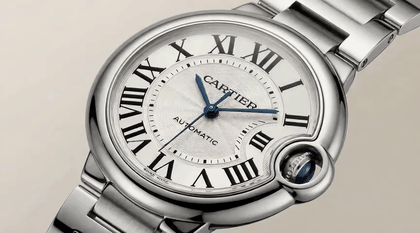
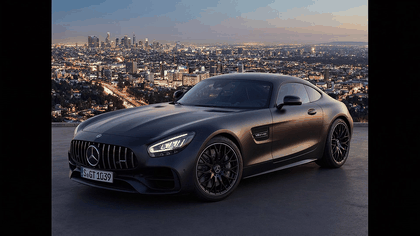
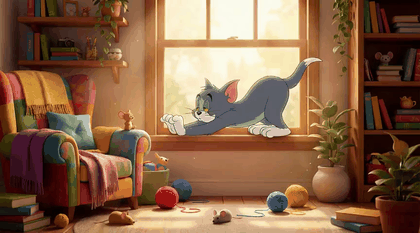
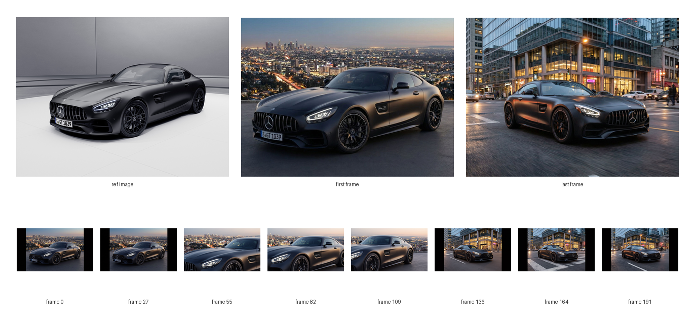

# Side Project: Artalor, an Agentic Framework for Long Video Creation

Date: 2026.05.31 | Author: Zihan Ding

This project began with a simple frustration: short AI video demos are magical, but production videos are not made of magic moments alone. A 5-10 second generated clip can look impressive on social media, but minute-length or hour-length video generation is a different challenge. A real advertisement, a product story, or a narrative video needs something more demanding: a script, pacing, visual continuity, voice, music, editing, review, retry, and version control.

In traditional filmmaking, these responsibilities are spread across a team: screenwriters shape the story, actors give it a voice and presence, directors control the visual language, and post-production artists stitch everything into a finished piece. With Artalor, we wanted to explore whether an AI system could integrate these roles into one coordinated production workflow. We also assumed from the beginning that the process would not be one-shot. Film production moves back and forth through drafts, reviews, cuts, and revisions, gradually absorbing the taste and judgment of the people making it. The frontend therefore became more than a place to press "generate"; it became an editing space where users can inspect intermediate results, revise individual assets, compare versions, and guide the system toward the video they actually want.

Artalor is my attempt to build that missing layer. It is a full-stack, multi-modal, agentic video production framework that turns a product image or a story idea into a longer finished video. It writes scripts, designs storyboards, generates images, produces video clips, synthesizes voiceovers, creates background music, assembles the final output, and lets humans edit the parts that the agent does not get right the first time.

<figure style="text-align:center;">
<div style="display:grid; grid-template-columns:repeat(2, 1fr); gap:12px;">




</div>
<figcaption>Animated previews from Artalor-generated videos. Each final video is assembled from script, key frames, video clips, voiceover, and background music. See the <a href="https://ads.artale.site/">project page</a> for full examples with audio.</figcaption>
</figure>

## Introduction

The first time I watched a high-quality AI-generated video clip, it felt like seeing a camera invented inside a neural network. A prompt went in; motion, light, and texture came out. The result was not merely an image anymore. It had time.

But after the excitement, there was an obvious question: what happens after ten seconds?

Most impressive video models are optimized around short bursts. They can create a beautiful shot: a sneaker rotating under studio lights, a dragon flying over a city, a cup of coffee steaming by a window. These clips are exciting, but they are not yet a complete production. A real video has structure. It has a beginning, development, and ending. It needs visual consistency across scenes. It needs narration that matches the pacing. It needs background music that supports the mood instead of randomly filling silence. It needs an editing loop, because generated media often contains artifacts, broken continuity, incomplete outputs, or blocked generations due to safety filters.

That gap became the motivation for Artalor: not another wrapper around a single model, but a system that treats AI video generation as a production workflow. Instead of training a giant native long-video model from scratch, which would require heavy model training and high-quality long-video datasets that are scarce in general, Artalor builds longer productions on top of existing short-video generators. Even when future models can generate longer clips directly, this workflow layer should still matter: people will not want to throw the dice on one long generation and accept whatever comes out. They will still need planning, editing, versioning, regeneration, and human control above the model. This also preserves some of the fun of creation: users can bring their own taste into the process, guide the result through review, and use that taste to improve quality instead of surrendering the entire creative decision to one model call.

This is also why we designed the Artalor editor interface as a central part of the framework, not just a viewer for the final result. It exposes the generated assets, prompts, model settings, and historical versions so users can guide the production process directly.

<figure style="text-align:center;">
<figcaption>The Artalor editor interface. Users can inspect generated assets, edit prompts and model settings, manage historical versions, and regenerate selected parts of the workflow.</figcaption></figure>

The original idea was shaped around two applications:

- Ad videos, where the user uploads a product image and the system creates a polished consumer-facing video.
- Storytelling, where the user starts from a narrative script or idea and the system expands it into a multi-scene audiovisual story.

Both applications sound simple from the outside. In practice, they reveal the same problem: long video generation is not one model call. It is a small studio.


## From Clip Generation to Production

A short generated clip can survive with ambiguity. If the camera angle is strange, the viewer may still enjoy it. If a hand looks slightly wrong, the clip is over before the brain complains too much. If the scene has no larger context, there is nothing to contradict.

A longer production is less forgiving.

If scene one says the product is matte black and scene three makes it glossy silver, the illusion breaks. If the voiceover finishes before the visual action has started, the rhythm feels wrong. If the background music is heroic but the script is quiet and intimate, the video becomes emotionally confused. If the model refuses one scene because a safety filter misreads the prompt, the whole pipeline can end with a missing segment.

So the core question changed from:

"Can we generate a cool video?"

to:

"Can we coordinate many imperfect generators into one coherent production?"

This shift changed the engineering design. Instead of asking one model to do everything, Artalor separates the work into stages. It first understands the input, then builds a plan, then creates assets, then assembles them, then exposes the intermediate results for review and repair.

The agent is not a magician. It is closer to a producer: it manages specialized workers, checks intermediate artifacts, remembers what has already been created, and allows the user to step in when taste or judgment is needed.


## A Full View of the Artalor Pipeline

A typical generation run looks like this:

```text
Product image / story idea
        |
        v
Input understanding + product/story analysis
        |
        v
Script + storyboard generation
        |
        v
Scene-level assets
        |
        +--> key frames  --> image generation
        +--> clips       --> video generation
        +--> voiceover   --> TTS
        +--> BGM         --> music generation
        |
        v
Final assembly
        |
        v
Preview + human edits
        |
        +--> regenerate selected node
        +--> preserve unchanged assets
```

Step 01 -- The user uploads a product image or provides a story idea.
Step 02 -- The system analyzes the product or story and extracts key visual and narrative attributes.
Step 03 -- The agent writes a structured script with timed segments.
Step 04 -- The graph designs the storyboard and turns it into scene-level prompts.
Step 05 -- Image models generate key frames for each scene, often grounded by the uploaded reference image.
Step 06 -- Video models animate the key frames into clips, using the first frame and sometimes the last frame as anchors.
Step 07 -- TTS models synthesize voiceover audio for each timed segment.
Step 08 -- Music models generate background music from mood keywords and the intended emotional arc.
Step 09 -- The editing node assembles images, clips, narration, and music into the final video.
Step 10 -- The user previews the result, edits prompts or hyperparameters, regenerates selected assets, and reruns only the necessary graph nodes.

The workflow looks clean. The actual process is more alive. Some generated assets are surprisingly good. Some are strange. Some are almost right. Some fail in ways that reveal hidden assumptions in the pipeline. The engineering task is to make those failures recoverable.

This is why caching, dirty flags, model configuration, and version management became core features rather than backend details. Long video generation is expensive in time and model calls. A good system should not punish the user for changing one sentence or one key-frame prompt. It should preserve what still works and reopen only the parts that need attention. Once the workflow has this many reusable assets, dependencies, and partial rerun paths, it naturally becomes more suitable for a graph-like pipeline such as LangGraph than for a simple linear chain.

## Why LangGraph

The first version of the idea naturally leaned toward LangChain-style chains. A chain is easy to imagine: analyze the input, write the script, generate the assets, assemble the video. Step one feeds step two, step two feeds step three, and so on.

That works until reality interrupts.

In a real video pipeline, not every step should run every time. If the user edits a voiceover sentence, the system should not regenerate every product image. If a video clip fails, the script should remain stable. If a background music prompt changes, the storyboard should not disappear. If the user wants to compare historical versions, the system needs to know which assets belong to which branch of the production.

This is why Artalor moved from a simple chain mindset to LangGraph. LangChain-style pipelines are useful when the process is mostly linear, but long video production needs more flexible workflow management. LangGraph lets each production step behave like a node with its own input state, output state, model configuration, checkpoint, and regeneration logic. This made the system feel more object-oriented: instead of one long script passing strings forward, each node owns a clearer responsibility and can be reasoned about as a production unit.

The workflow is better represented as a stateful graph with nodes, dependencies, checkpoints, and dirty flags. Each node owns a part of the production:

- `image_understanding` -- analyzes the uploaded product or visual input.
- `product_analysis` -- extracts style, colors, product features, and mood.
- `storyboard_design` -- plans the visual sequence.
- `segmented_monologue` -- writes the timed narration.
- `segmented_tts` -- generates voiceover audio for each segment.
- `image_generation` -- creates visual frames or scene images.
- `video_generation` -- turns images and prompts into motion.
- `bgm` -- generates or selects background music.
- `edit` -- assembles the final video from all produced assets.

The graph structure makes the system feel less like a fragile script and more like a production board. If a node changes, downstream nodes can be rerun. If a node is unchanged, cached results can remain. If the user regenerates a single asset, the rest of the production does not need to be thrown away. This was especially important because the system has to preserve references to the user's uploaded image, whether it is a key product image for an ad or a key character image for a story. That reference has to flow through the graph as shared production memory, not disappear after the first prompt.

That design became especially important once the system started supporting many models. Artalor is built to call and switch among more than 50 models across modalities: language models for script and planning, image models for scene generation, video models for motion, TTS models for voice, and music models for background audio. The point is not to worship model count. The point is that no single model is best for every production job. A system for creation needs optionality.

## Building a Small Studio

The backend is a Flask server that coordinates the workflow. The frontend is a lightweight web interface for previewing, editing, regenerating, and managing assets. The important part is not the framework choice itself, but the separation of responsibilities: the backend behaves like the production engine, while the frontend behaves like the editing room.

In the backend, the workflow state stores the outputs of each generation stage. A video is not treated as one opaque artifact. It is a bundle of structured assets: script segments, prompts, images, clips, audio files, background music, and final assembly metadata. This makes the system slower to design but much easier to repair.

In the frontend, the user can inspect the generated assets instead of only seeing the final video. This changed the feel of the product. When generation fails, the user does not have to restart from scratch. They can edit a line of narration, regenerate one clip, adjust a scene description, replace a background music prompt, or rerun the affected part of the graph.

This was one of the most important lessons of the project: for creative AI, the intermediate artifacts are part of the interface.

If the user only sees the final video, every problem feels mysterious. If they can see the script, storyboard, image prompt, generated frame, audio segment, and final composition, they can understand where the problem entered the pipeline. The system becomes less like a black box and more like a collaborator with a visible notebook.

## Some Problems We Solved

### Visual Consistency

The first problem was visual consistency. Long videos break easily when the main subject changes from scene to scene. For ads, the product should remain recognizable across shots. For storytelling, a key character should not quietly become a different person after the second clip. To reduce this drift, Artalor keeps a reference to the user's uploaded image throughout the workflow. The image can represent the product, the protagonist, or another visual anchor. Before generating each short video clip, the system first creates key frames with an image generation model, using text-to-image or image-to-image generation depending on the task. The video generation step then anchors the clip with the first frame and, when the model supports it, an optional last frame. This gives each short clip a visual boundary and helps the long video feel like one production instead of unrelated generated fragments.

<figure style="text-align:center;">
<figcaption>Key-frame anchoring helps preserve the product identity across a generated video clip. The uploaded reference image guides generated first and last frames, and the video model interpolates motion between them.</figcaption></figure>

### Prompt Decomposition

We also found it useful to think about prompt decomposition as a small production tree:

```text
User idea / uploaded image
        |
        v
Story analysis
        |
        v
Storyboard prompt
        |
        v
Scene 1, Scene 2, ..., Scene N
        |
        +--> first-frame prompt  --> image model
        +--> last-frame prompt   --> image model
        +--> motion prompt       --> video model
        +--> voiceover prompt    --> TTS model
        +--> mood / BGM prompt   --> music model
```

The second problem was prompt decomposition. A long video does not have one prompt. It has many prompts at different levels of abstraction. We built this logic into a module we call **Prompt Orchestrator**, which translates the high-level story or product goal into modality-specific instructions. There is a storyboard prompt that asks the language model to plan the video. The storyboard then becomes a structured set of scenes. Each scene needs prompts for key frames, prompts for video motion, prompts for the voiceover segment, and prompts for background music or mood. Each modality speaks a slightly different language. A good image prompt describes composition, lighting, style, and subject identity. A good video prompt adds camera movement, temporal action, and transition. A good voiceover prompt cares about tone, pacing, and pronunciation. A good BGM prompt describes emotional texture rather than visual detail. Artalor therefore treats prompts as first-class assets, not disposable strings hidden inside backend calls.

For example, in one real story-video run, the entire user input was only:

> "a cat fight with mouse and dog"

From that tiny seed, the storyboard node expanded the idea into scene-level production notes:

> "The cat prowls the backyard, spots the mouse nibbling cheese. The cat stealthily moves from bush to bush, eyes locked on the mouse. The mouse enjoys its cheese until the last second, when it senses the cat's presence and freezes."

Then the image node used a first-frame prompt to establish the scene:

> "A vibrant garden with lush green grass and colorful flowers. The cat, a sleek orange tabby, crouches low behind a bush, its eyes wide with focus and determination. The mouse, a small brown creature, nibbles on a piece of yellow cheese..."

The last-frame prompt described where the clip should land:

> "The mouse looks up suddenly, cheese in its tiny paws, as the cat prepares to pounce from behind the bush. The setting remains vivid, with a slight breeze causing leaves to sway gently."

The video prompt focused less on static composition and more on temporal motion:

> "The cat stealthily moves from bush to bush, eyes locked on the mouse. The mouse enjoys its cheese until the last second, when it senses the cat's presence and freezes."

The voiceover prompt carried a different kind of intent, with language, style, pacing, and narration text:

> "Voice style: playful, reflective, adventurous. Pacing: medium. In a vibrant backyard where a cunning cat prowls, a tale unfolds of unexpected alliances..."

The BGM prompt follows the same pattern, but from mood and style rather than visual action. In the framework, the BGM node composes prompts in this form:

> "Background music for an advertisement. Mood: energetic. Style: modern, cinematic, clean mix."

This is why BGM cannot be treated as an afterthought. Its prompt should not merely say "add music"; it should describe the mood, energy, and emotional arc that the final edit needs. In the system design, script, storyboard, key-frame, video, voiceover, and BGM prompts all become editable production materials.

### Editability and Version Control

The third problem was editability. Once the system calls models across text, image, video, audio, and music, every model call has its own prompt, hyperparameters, input assets, and output files. If these details stay hidden, users can only accept or reject the final result. Artalor exposes prompts and model specifications in the frontend so users can adjust the scene description, change generation parameters, pick a different model, or regenerate one modality without rerunning the entire graph. Node status checkpointing makes this practical. The system can remember which nodes succeeded, which assets belong to which version, and which downstream results became stale after an edit. Instead of treating regeneration as a full restart, the workflow treats it as a controlled revision.

## Human in the Loop Is Not a Backup Plan

At first, "fully automated video generation" sounds like the goal. Upload something, press one button, receive a finished production. Artalor can do that, and automation is still central to the project.

But the more we tested the system, the more obvious it became that human-in-the-loop editing is not a compromise. It is part of the product.

Generative models are powerful, but they are still messy production partners. They may produce a beautiful image with a wrong logo. They may create a strong video clip with an awkward object deformation. They may write a good script that is slightly too dramatic for the brand. They may generate only part of an expected output because a safety filter or NSFW classifier blocks a prompt. They may make one scene visually impressive but inconsistent with the previous one.

In a demo, these issues can be hidden by only showing the best output. In a real production workflow, the system has to handle them directly: identify what went wrong, let the user revise the broken part, and regenerate only what needs to change.

So Artalor supports fine-grained editing and regeneration. A user can modify one audio segment, regenerate a single video clip, change an image prompt, or adjust background music without destroying the entire video. The frontend also supports historical version management, so experiments do not erase previous attempts. This matters because creative work is not linear. Sometimes the third version has the best image, the fifth version has the best voiceover, and the first version had the clearest story.

The agent should therefore remember history. It should allow exploration. It should make failure cheap.

## Applications: Ads and Stories

We designed Artalor around two potential applications that stress the framework in different ways.

The first is ad video generation. A user uploads a product image. The system analyzes the product: what it is, what visual style it suggests, what colors and mood it carries, and what kind of message might fit. From that analysis, the agent writes a script, divides it into timed segments, designs storyboard frames, generates images and video clips, creates voiceover audio, selects or generates background music, and assembles the result into a final ad. This use case is immediately practical: a small business, creator, or marketer may not have a production team, a studio, a voice actor, a music library, and an editor, but they may have a product photo and a rough idea.

The second is storytelling video generation. Instead of beginning from a product, the user begins from a story. The system treats the script as the spine of the video, then builds the visual plan around it. This is more open-ended and more fragile, because stories carry continuity, characters, tone, and pacing. But it is also where the project becomes more interesting. A story is not just a sequence of assets; it is an emotional contract with the viewer.

These two directions also balance each other. Ads keep the system grounded: the output must be useful, clear, and complete. Storytelling keeps the system ambitious: the output must be expressive, coherent, and emotionally interesting.

Together, they pushed Artalor toward a broader goal: a full-modality video generation framework, not a single-purpose demo. Artalor is not restricted to these two cases. Ads and storytelling are useful design anchors, while the framework itself is general: any application that can be expressed as script planning, asset generation, editing, and final assembly can be built on top of the same graph.


## Lessons Learned

The biggest lesson is that AI media systems need taste surfaces. A "taste surface" is any point where the user can express preference: rewrite this sentence, make this image calmer, regenerate this clip, use a warmer voice, reduce the music intensity, keep this version, compare that version. Without those surfaces, the user is trapped inside the model's first answer.

The second lesson is that orchestration matters as much as generation. A better video model helps, but it does not solve script timing, asset dependency, prompt management, reference-image consistency, frontend review, version history, partial failures, or final assembly. The system around the model determines whether the output becomes a usable product.

The third lesson is that long-form generation should be modular by default. In text generation, one can often regenerate the whole answer cheaply. In video generation, regenerating everything is slow, expensive, and creatively destructive. The unit of repair should be smaller than the final video: a prompt, a key frame, a clip, a voice segment, or one graph node.

Finally, I learned that "agentic" should not mean "the agent does whatever it wants." For creative production, a good agent should expose its plan, preserve its intermediate work, accept edits, and rerun intelligently. The human is still the director.

## Closing Thoughts

Artalor started from a simple observation: short video generation is impressive, but long video production is a different problem. The difference is not just duration. It is coordination. It is continuity. It is recovery from failure. It is giving the user enough control to shape the result without forcing them to become a professional editor.

By combining LangGraph workflows, multi-modal model calls, asset-level regeneration, human-in-the-loop editing, frontend version management, and full-stack video assembly, Artalor becomes more than a demo pipeline. It becomes an automated creative production framework.

There is still a lot to improve: stronger story consistency, better visual identity preservation, smarter model routing, richer timeline editing, and more reliable evaluation of generated assets. But the direction feels clear. The future of AI video will not be only about making the next 10-second clip more beautiful. It will be about building systems that can carry an idea through the entire production process.

That is the part I find most exciting: not the model producing a single stunning shot, but the possibility of a small agentic studio that helps people turn products, stories, and imagination into complete videos.

## References

1. Project page: [https://ads.artale.site/](https://ads.artale.site/)
2. Project code: [https://github.com/artale-org/Artalor-Agent](https://github.com/artale-org/Artalor-Agent)
